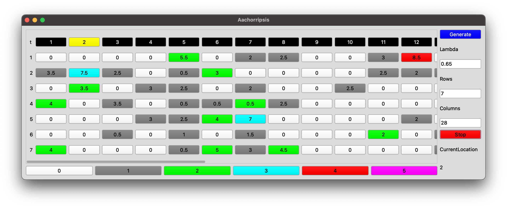

# Aachorripsis



Implementation of Iannis Xenakis composition *Aachorripsis* in SuperCollider based on his notes in *Formalized Music*.

## Installation

Install this extension as a [quark](https://doc.sccode.org/Guides/UsingQuarks.html) via

```supercollider
Quarks.install("https://github.com/capital-G/Aachorripsis.git");
// restart sclang
thisProcess.recompile;
```

You can update it via

```supercollider
Quarks.update("Aachorripsis");
thisProcess.recompile;
```

## Usage

`AachorripsisGUI` allows you to generate and examine a matrix (according to *Formalized Music*) as well as starting a [Tdef](https://doc.sccode.org/Classes/Tdef.html) with the name `\aachorripsis`.
Take a look into the provided `aachoripsis-play.scd` which also includes an example how to use the matrix events as gates or envelopes in an eurorack environment.

## Implementation

When comparing the score and matrix with the written notes in *Formalized Music* there are some discrepancies which are documented in this section.

### Normal distributed density

A 2-event shall have a fixed density of events which originates from the poisson distribution.
This becomes obvious when comparing why a single event has the density between 3.5 and 6.5 while it averages around 5.0.
Therefore it seems that within all 2-events there is a deviation and after some plotting I think Xenakis applied a normal distribution among the density of each event class, therefore I added the `sigma` parameter which allows to control the variance of the normal distribution and therefore the spread of its values around the mean.

### Wood block sample

Xenakis is infamous for his use of wood blocks in compositions - listen e.g. to *Metastaseis*.
Although it is not noted in *Formalized Music* the wood block appears in parts with low or no density in the score of *Aachorripsis*.
I assume that it was used in sparse sections to provide some orientation, therefore it is also played back here in sparse sections as it also is a trademark of Xenakis.

Also the orchestral score released by *Bote & Bock* does not give any hints of the origins of the woodblock hits.

The included sample is provided by *lostphosphene* via [freesound.org](https://freesound.org/people/lostphosphene/sounds/250386/).

## Performance

The source code was written for a concert on 2022-10-25 in honor of Xenakis 100th birthday.
Instead of the 7 instrument groups it was performed with 2 modular synthesizer systems which received 7 gates to trigger musical events.
See the [website of the concert](https://capital-g.github.io/xenakis-workgroup/concert.html#aachorripsis-recalculated) for further details.

## License

GPL-2.0
